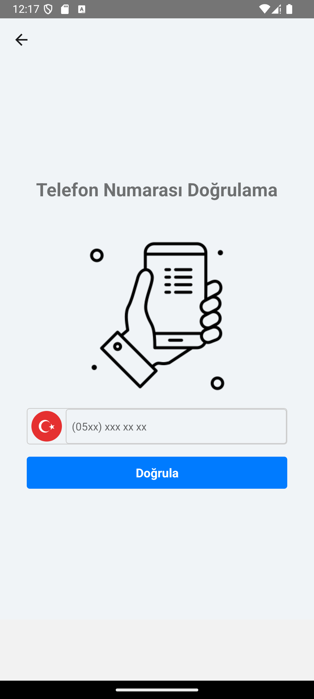
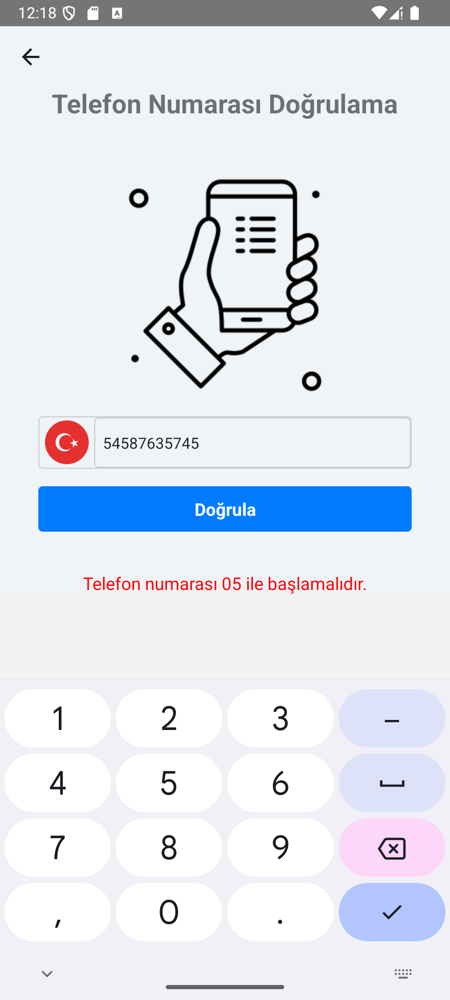
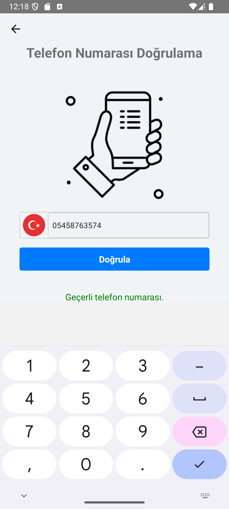
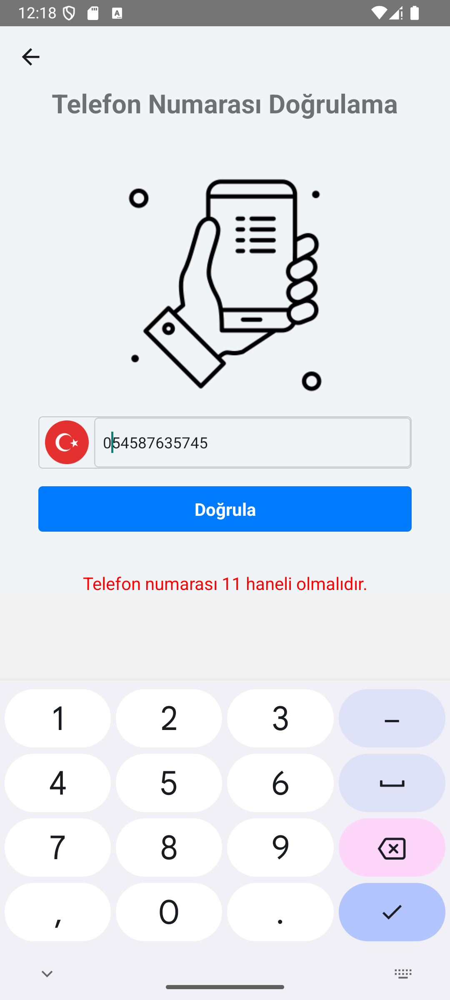

## React Native Phone Number Validator App

## Installation

Before running the application, make sure you have completed the React Native environment setup and have created a new React Native project using @react-native-community/cli. Once you have set up your project, follow these steps:

The link to my created npm package is : [https://www.npmjs.com/package/validator-phone-number ](https://www.npmjs.com/package/validator-phone-number) 


[(https://www.npmjs.com/package/validator-phone-number)

Install the validator-phone-number package using npm or Yarn:

```bash
# using npm
npm install validator-phone-number

# OR using Yarn
yarn add validator-phone-number
```
## Screenshots

 |  |  
 |  | 
